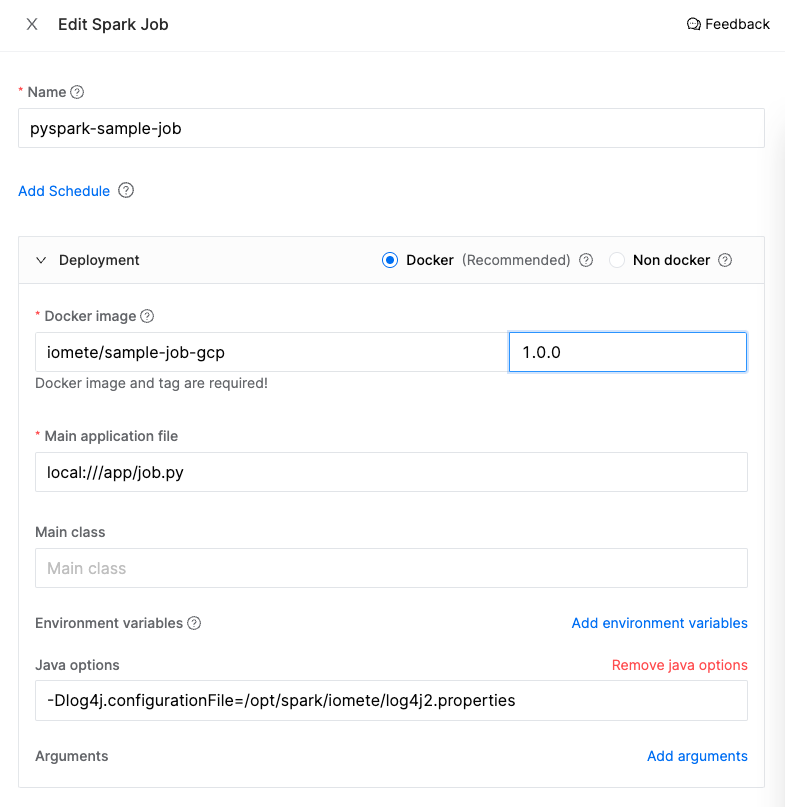
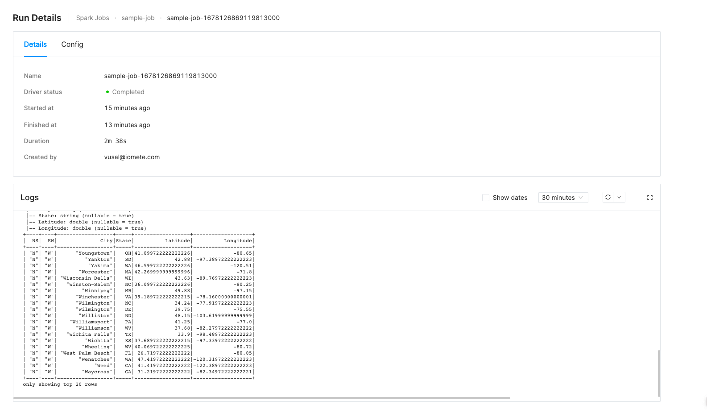

# Sample Job Template for GCP

This repository contains a sample PySpark job template as a starting point for your own jobs. Just clone this repository and start developing your job.

## How can I use this template?

This template is meant to be used as a starting point for your own jobs. You can use it as follows:

1. Clone this repository
2. Modify the code and tests to fit your needs
3. Build the Docker image and push it to your Docker registry
4. Create a Spark Job in the Iomete Control Plane
5. Run the Spark Job
6. Modify the code and tests as needed
7. Go to step 3

> Note: If you are just starting with PySpark at IOMETE, you can just explore the sample code without modifying it. 
> It will help you understand process of creating a Spark Job and running it.


## Project Structure

The project is composed of the following folders/files:
- `infra/`: contains requirements and Dockerfile files  
  - `requirements-dev.txt`: contains the list of python packages to install for development
  - `requirements.txt`: contains the list of python packages to install for production. This requirements file is used to build the Docker image
  - `Dockerfile`: contains the Dockerfile to build the spark job image
- `spark-conf/`: contains the spark configuration files for development environment
  - `spark-defaults.conf`: contains the spark configuration
  - `log4j2.properties`: contains the log4j configuration for the PySpark job. This file is used to configure the logging level of the job
- `test_data/`: contains the test data for the job unit/integration tests
- `job.py`: contains the spark job code. Template comes with a sample code that reads a csv file from S3 and writes the data to a table in the Lakehouse. Feel free to modify the code to fit your needs.
- `test_job.py`: contains the spark job tests. Template comes with a sample test that reads the test data from `test_data/` and asserts the output of the job. Feel free to modify the tests to fit your needs.
- `Makefile`: contains the commands to run the job and tests

## How to run the job

First, create a virtual environment and install the dependencies:

```bash
virtualenv .env
source .env/bin/activate

# make sure you have python version 3.7.0 or higher
make install-dev-requirements
```

Also, set the `SPARK_CONF_DIR` environment variable to point to the `spark_conf` folder. This is needed to load the spark configuration files for local development:
```bash
export SPARK_CONF_DIR=./spark_conf
```

Set `spark.hadoop.google.cloud.auth.service.account.json.keyfile` to point to the path of your GCP service account key file. This is needed to run the job locally. 

> Note: If you don't have a service account key file, you can create one by following the instructions [here](https://cloud.google.com/iam/docs/creating-managing-service-account-keys). For this sample application, the service account doesn't need any special permissions since it's accessing public data.

Then, you can run the job:

```bash
python job.py
```

## How to run the tests

> Note: Make sure you have installed the dependencies, and exported the `SPARK_CONF_DIR` environment variable as described in the previous section.

To run the tests, you can use the `pytest` command:
```bash
pytest
```

## Deployment

### Build Docker Image

In the Makefile, modify `docker_image` and `docker_tag` variables to match your Docker image name and tag. 
For example, if you push your image to AWS ECR, your docker image name will be something like `123456789012.dkr.ecr.us-east-1.amazonaws.com/my-image`.

Then, run the following command to build the Docker image:

```bash
make docker-push
```

Once the docker is built and pushed to your Docker registry, you can create a Spark Job in the IOMETE.


### Creating a Spark Job

There are two ways to create a Spark Job in the IOMETE:
1. Using the Iomete Control Plane UI
2. Using the Iomete Control Plane API

**Using the IOMETE Control Plane UI**

1. Go to `Spark Jobs` page
2. Click on `Create New` button
3. Provide the following information:
   - `Name`: `pyspark-sample-job`
   - `Image`: `iomete/sample-job-gcp:1.0.0`
   - `Main Application File`: `local:///app/job.py`
   - `Java options (optional)`: `-Dlog4j.configurationFile=/opt/spark/iomete/log4j2.properties`

Leave the rest of the fields as default.




**Using the IOMETE Control Plane API**


First set `WORKSPACE_ENDPOINT` and `API_TOKEN` environment variables. Retrieve 
- `API TOKEN` from here: https://app.iomete.cloud/user-settings/personal-access-token
- `WORKSPACE_ENDPOINT` from the `Workspace Settings` page.

```bash
export WORKSPACE_ENDPOINT="<your workspace id>"
export API_TOKEN="<your api token>"
```

```bash
curl -v --request POST \
--url $WORKSPACE_ENDPOINT/spark-jobs \
--header "Content-Type: application/json" \
--header "X-API-TOKEN: $API_TOKEN" \
--data '{
      "name": "pyspark-sample-job",
      "template": {
            "spark_version": "3.2.1",
            "image": "iomete/sample-job-gcp:1.0.1",
            "main_application_file": "local:///app/job.py",
            "java_options": "-Dlog4j.configurationFile=/opt/spark/iomete/log4j2.properties",
            "instance_config": {
                  "driver_type": "e2-medium",
                  "executor_type": "e2-standard-2",
                  "executor_count": 2
            }
      }
}'
``` 

### Run Spark Job

Once the Spark Job is created, you can run it using the Iomete Control Plane UI or API. To run it from the UI, go to the `Spark Jobs` page and click on the `Run` button. 
To run it from the UI, click on the `Run` button.

To run it from the API, first set `JOB_ID` environment variable to the ID of the Spark Job you created in the previous step. Then, run the following command:

```bash
export JOB_ID="e417bec5-081a-4c78-b3ba-314bc13d1623"

curl -v --request POST \
  --url $WORKSPACE_ENDPOINT/spark-jobs/$JOB_ID/runs \
  --header "X-API-TOKEN: $API_TOKEN"
```

You can monitor and check the status of the Spark Job run from the `Spark Job Runs` page:




